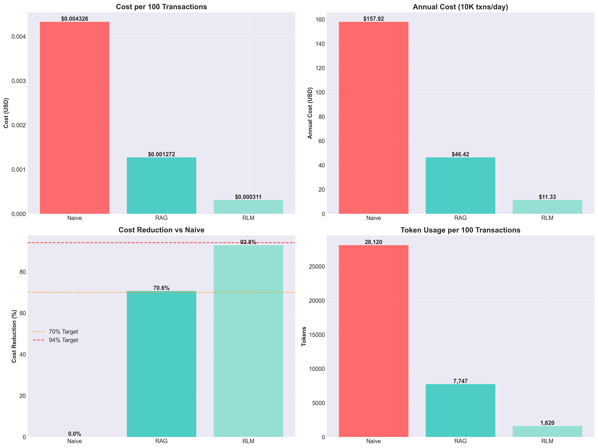
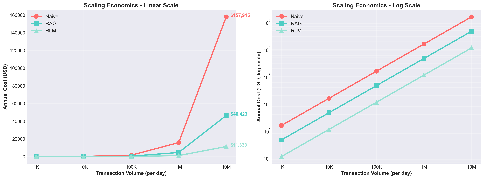

# Results: 8 Fraud Scenarios

All results from live API calls to gpt-4o-mini with temperature=0.
Cached for reproducibility in
[`notebooks/rlm_demo_cache.json`](https://github.com/Abivarma/smart-llm-fraud-detection/blob/main/notebooks/rlm_demo_cache.json).

---

## Aggregate Summary

| Metric | Naive (Total) | RLM (Total) | Savings |
|--------|--------------|------------|---------|
| Tokens | 185,661 | 3,059 | **98.4%** |
| Cost | $0.0285 | $0.0008 | **97.1%** |
| Accuracy | 94% (48/51) | **100%** (51/51) | +6pp |
| Precision | 96% | **100%** | +4pp |
| Recall | 92% | **100%** | +8pp |
| F1 Score | 0.94 | **1.00** | +0.06 |

---

## Per-Scenario Comparison

| # | Scenario | Txns | Fraud | Naive Tokens | RLM Tokens | Savings | Naive Acc | RLM Acc |
|---|----------|------|-------|-------------|-----------|---------|-----------|---------|
| 1 | Velocity Attack | 5 | 5 | 23,167 | 387 | 98.3% | 100% | 100% |
| 2 | Geographic Impossibility | 4 | 2 | 23,013 | 368 | 98.4% | 100% | 100% |
| 3 | Amount Spike | 5 | 1 | 23,040 | 379 | 98.4% | 100% | 100% |
| 4 | Account Takeover | 5 | 2 | 23,112 | 385 | 98.3% | 100% | 100% |
| 5 | Micro-Transaction Testing | 8 | 8 | 23,527 | 511 | 97.8% | 100% | 100% |
| 6 | Legitimate High-Value | 4 | 0 | 23,009 | **0** | **100%** | 75% | **100%** |
| 7 | Mixed Batch | 15 | 4 | 23,663 | 662 | 97.2% | 93% | **100%** |
| 8 | Cross-Border Rapid | 5 | 4 | 23,130 | 367 | 98.4% | 80% | **100%** |

Scenario 6 is notable: RLM used **zero tokens** because no filters triggered
on the legitimate high-value user. Naive still sent 23,009 tokens and
incorrectly flagged one transaction as fraud.

---

## Scenario Deep Dives

<strong>Scenario 1: Velocity Attack</strong> -- 5 txns in 3 minutes, card testing pattern

<strong>Why RLM wins</strong>: Code detects time_diff &lt; 300s deterministically; Naive sends 22K tokens for the same result.

<strong>Input</strong>: 5 transactions from U_VEL_01, all within 178 seconds in NYC on mobile.

<table>
<tr><th>TXN</th><th>Amount</th><th>Category</th><th>Label</th></tr>
<tr><td>TXN_S1_001</td><td>$45.99</td><td>electronics</td><td>FRAUD</td></tr>
<tr><td>TXN_S1_002</td><td>$52.30</td><td>electronics</td><td>FRAUD</td></tr>
<tr><td>TXN_S1_003</td><td>$38.75</td><td>clothing</td><td>FRAUD</td></tr>
<tr><td>TXN_S1_004</td><td>$61.20</td><td>electronics</td><td>FRAUD</td></tr>
<tr><td>TXN_S1_005</td><td>$47.85</td><td>electronics</td><td>FRAUD</td></tr>
</table>

<strong>RLM trajectory</strong>:

<ul>
<li>PROBE: 1 user, 5 txns, 178s span</li>
<li>FILTER: velocity_filter flags all 5 (5 txns in 178s). No other filters trigger.</li>
<li>ANALYZE: 1 sub-call, 387 tokens. Verdict: fraud (high velocity pattern).</li>
<li>AGGREGATE: 5/5 confirmed fraud. Correct.</li>
</ul>

<table>
<tr><th>Metric</th><th>Naive</th><th>RLM</th></tr>
<tr><td>Tokens</td><td>23,167</td><td>387</td></tr>
<tr><td>Cost</td><td>$0.0036</td><td>$0.0001</td></tr>
<tr><td>Accuracy</td><td>100%</td><td>100%</td></tr>
</table>

<strong>Scenario 2: Geographic Impossibility</strong> -- NYC to Tokyo in 10 minutes

<strong>Why RLM wins</strong>: Code checks location+time pairs; RAG cannot do distance/time math.

<strong>Input</strong>: 4 transactions from U_GEO_01. First 2 in NYC, then 2 in Tokyo 500 seconds later.

<table>
<tr><th>TXN</th><th>Amount</th><th>Location</th><th>Device</th><th>Label</th></tr>
<tr><td>TXN_S2_001</td><td>$28.50</td><td>NYC</td><td>mobile</td><td>LEGIT</td></tr>
<tr><td>TXN_S2_002</td><td>$32.00</td><td>NYC</td><td>mobile</td><td>LEGIT</td></tr>
<tr><td>TXN_S2_003</td><td>$89.99</td><td>Tokyo</td><td>desktop</td><td>FRAUD</td></tr>
<tr><td>TXN_S2_004</td><td>$125.00</td><td>Tokyo</td><td>desktop</td><td>FRAUD</td></tr>
</table>

<strong>RLM trajectory</strong>:

<ul>
<li>FILTER: geo_filter flags NYC->Tokyo (impossible travel). device_shift_filter also flags desktop shift.</li>
<li>ANALYZE: 1 sub-call, 368 tokens. Confirms fraud for Tokyo transactions.</li>
<li>Result: 2/4 correctly flagged. 50% filtered out.</li>
</ul>

<table>
<tr><th>Metric</th><th>Naive</th><th>RLM</th></tr>
<tr><td>Tokens</td><td>23,013</td><td>368</td></tr>
<tr><td>Cost</td><td>$0.0035</td><td>$0.0001</td></tr>
<tr><td>Accuracy</td><td>100%</td><td>100%</td></tr>
</table>

<strong>Scenario 3: Amount Spike</strong> -- $19 average, suddenly $487 on jewelry

<strong>Why RLM wins</strong>: Code computes leave-one-out std dev (z=170.61); LLM confirms category shift.

<strong>Input</strong>: 5 transactions from U_AMT_01. First 4 are $15-22 grocery/gas on mobile. Last is $487.50 jewelry on desktop.

<strong>RLM trajectory</strong>:

<ul>
<li>FILTER: amount_anomaly_filter flags TXN_S3_005 (z=170.61). device_shift_filter also flags it. <strong>80% filtered out.</strong></li>
<li>ANALYZE: 1 sub-call, 379 tokens. Confirms $487.50 vs $19.14 average + device change.</li>
<li>Result: 1/5 correctly flagged as fraud.</li>
</ul>

<table>
<tr><th>Metric</th><th>Naive</th><th>RLM</th></tr>
<tr><td>Tokens</td><td>23,040</td><td>379</td></tr>
<tr><td>Cost</td><td>$0.0035</td><td>$0.0001</td></tr>
<tr><td>Accuracy</td><td>100%</td><td>100%</td></tr>
<tr><td>Data to LLM</td><td>5 txns + 500 cases</td><td>1 txn + 4 baseline</td></tr>
</table>

<strong>Scenario 4: Account Takeover</strong> -- mobile/LA/grocery to desktop/Chicago/gift_cards

<strong>Why RLM wins</strong>: Multi-filter cross-check: device_shift catches subtle ATO pattern.

<strong>Input</strong>: 5 transactions from U_ATO_01. First 3 are typical ($18-25, LA, mobile, grocery). Last 2 shift to Chicago, desktop, gift_cards/electronics at $189-245.

<strong>RLM trajectory</strong>:

<ul>
<li>FILTER: device_shift_filter flags TXN_S4_004, TXN_S4_005. <strong>60% filtered out.</strong></li>
<li>ANALYZE: 1 sub-call, 385 tokens. Confirms account takeover pattern.</li>
<li>Result: 2/5 correctly flagged.</li>
</ul>

<table>
<tr><th>Metric</th><th>Naive</th><th>RLM</th></tr>
<tr><td>Tokens</td><td>23,112</td><td>385</td></tr>
<tr><td>Cost</td><td>$0.0035</td><td>$0.0001</td></tr>
<tr><td>Accuracy</td><td>100%</td><td>100%</td></tr>
</table>

<strong>Scenario 5: Micro-Transaction Testing</strong> -- 8 automated $1-2 txns in 2 minutes

<strong>Why RLM wins</strong>: Velocity filter catches count + timing; RAG finds no similar historical cases for $1 transactions.

<strong>Input</strong>: 8 transactions from U_MICRO_01, $1.00-1.91, all digital_goods, 105-second span.

<strong>RLM trajectory</strong>:

<ul>
<li>FILTER: velocity_filter flags all 8 (8 txns in 105s).</li>
<li>ANALYZE: 1 sub-call, 511 tokens. Confirms bot-like testing pattern.</li>
<li>Result: 8/8 correctly flagged.</li>
</ul>

<table>
<tr><th>Metric</th><th>Naive</th><th>RLM</th></tr>
<tr><td>Tokens</td><td>23,527</td><td>511</td></tr>
<tr><td>Cost</td><td>$0.0037</td><td>$0.0001</td></tr>
<tr><td>Accuracy</td><td>100%</td><td>100%</td></tr>
</table>

<strong>Scenario 6: Legitimate High-Value</strong> -- consistent $200-400 user, should NOT be flagged

<strong>Why RLM wins</strong>: Filters correctly pass through (no anomaly). Naive over-flags due to high amounts.

<strong>Input</strong>: 4 transactions from U_LEGIT_01. All $189-312, NYC, desktop, electronics/clothing/jewelry. Consistent high-value user. <strong>Zero fraud.</strong>

<strong>RLM trajectory</strong>:

<ul>
<li>FILTER: No filters trigger. All transactions are consistent with user profile.</li>
<li>ANALYZE: <strong>Skipped entirely</strong> -- no suspicious transactions found.</li>
<li>Result: 0 tokens used. 0 false positives. Correct.</li>
</ul>

<strong>Naive result</strong>: Incorrectly flagged TXN_S6_004 ($275.00 jewelry) as fraud. <strong>False positive.</strong>

<table>
<tr><th>Metric</th><th>Naive</th><th>RLM</th></tr>
<tr><td>Tokens</td><td>23,009</td><td><strong>0</strong></td></tr>
<tr><td>Cost</td><td>$0.0035</td><td><strong>$0.0000</strong></td></tr>
<tr><td>Accuracy</td><td>75%</td><td><strong>100%</strong></td></tr>
<tr><td>False Positives</td><td>1</td><td>0</td></tr>
</table>

This is the most dramatic example: RLM achieved perfect accuracy with zero cost, while Naive spent $0.0035 and still got it wrong.

<strong>Scenario 7: Mixed Batch</strong> -- 5 users, 15 txns, 2 fraudulent users

<strong>Why RLM wins</strong>: Per-user sub-calls analyze 5 users independently; Naive sends all 15 + 500 cases in one prompt.

<strong>Input</strong>: 15 transactions across 5 users. U_MIX_B has velocity fraud (3 txns in 65s). U_MIX_D has amount anomaly ($550 jewelry vs $18-25 average). Other 3 users are legitimate.

<strong>RLM trajectory</strong>:

<ul>
<li>PROBE: 5 users identified (3, 3, 3, 4, 2 txns each).</li>
<li>FILTER: velocity_filter flags U_MIX_B (3 txns). amount_anomaly flags TXN_S7_013 (z=146.72). device_shift flags U_MIX_D. <strong>73% filtered out.</strong></li>
<li>ANALYZE: 2 sub-calls (one per flagged user), 662 tokens total.</li>
<li>Result: 4/15 correctly flagged, 11/15 correctly cleared.</li>
</ul>

<strong>Naive result</strong>: Missed TXN_S7_004 (velocity fraud). <strong>False negative.</strong>

<table>
<tr><th>Metric</th><th>Naive</th><th>RLM</th></tr>
<tr><td>Tokens</td><td>23,663</td><td>662</td></tr>
<tr><td>Cost</td><td>$0.0036</td><td>$0.0002</td></tr>
<tr><td>Accuracy</td><td>93%</td><td><strong>100%</strong></td></tr>
<tr><td>Recall</td><td>75%</td><td><strong>100%</strong></td></tr>
</table>

<strong>Scenario 8: Cross-Border Rapid</strong> -- London to Paris to Tokyo to Sydney in 30 minutes

<strong>Why RLM wins</strong>: Geo + velocity filters both trigger = high confidence; RAG misses temporal pattern.

<strong>Input</strong>: 5 transactions from U_XBORDER_01 across 4 cities in 30 minutes. First transaction (London) is legitimate home base; next 4 are impossible travel.

<strong>RLM trajectory</strong>:

<ul>
<li>FILTER: geo_filter flags London->Paris (impossible travel). device_shift flags desktop shift. <strong>20% filtered out.</strong></li>
<li>ANALYZE: 1 sub-call, 367 tokens. Confirms all 4 non-home transactions as fraud.</li>
<li>Result: 4/5 correctly flagged, 1/5 correctly cleared.</li>
</ul>

<strong>Naive result</strong>: Missed TXN_S8_005 (Sydney). <strong>False negative.</strong>

<table>
<tr><th>Metric</th><th>Naive</th><th>RLM</th></tr>
<tr><td>Tokens</td><td>23,130</td><td>367</td></tr>
<tr><td>Cost</td><td>$0.0036</td><td>$0.0001</td></tr>
<tr><td>Accuracy</td><td>80%</td><td><strong>100%</strong></td></tr>
<tr><td>Recall</td><td>75%</td><td><strong>100%</strong></td></tr>
</table>

---

## Where Naive Fails

Three scenarios where the monolithic prompt approach made errors:

| Scenario | Naive Error | Type | RLM Result |
|----------|------------|------|-----------|
| 6. Legitimate High-Value | Flagged $275 jewelry as fraud | False Positive | Correct (0 tokens used) |
| 7. Mixed Batch | Missed velocity fraud (TXN_S7_004) | False Negative | Caught all 4 fraud txns |
| 8. Cross-Border Rapid | Missed Sydney transaction (TXN_S8_005) | False Negative | Caught all 4 fraud txns |

In all three cases, the failure traces to context rot: with 23,000+ tokens
in the prompt, the model's attention was diluted and it either over-flagged
(Scenario 6) or missed signals (Scenarios 7, 8).

---

## Cost Projections

| Daily Volume | Naive / Year | RLM / Year | Annual Savings |
|-------------|-------------|-----------|----------------|
| 1K txns | $204 | $6 | $198 |
| 10K txns | $2,042 | $60 | $1,982 |
| 100K txns | $20,415 | $599 | $19,816 |
| 1M txns | $204,153 | $5,992 | $198,161 |
| 10M txns | $2,041,531 | $59,924 | **$1,981,606** |

Per-transaction cost: Naive = $0.000559, RLM = $0.000016.
Based on gpt-4o-mini pricing ($0.15/1M input, $0.60/1M output tokens).

---

## Methodology

- **Model**: gpt-4o-mini with temperature=0 for deterministic output
- **Dataset**: 51 synthetic transactions across 8 scenarios with ground truth labels
- **Cached results**: All API responses saved in `rlm_demo_cache.json` for reproducibility
- **Naive baseline**: Sends all transactions + 500 historical fraud cases in a single prompt
- **RLM approach**: 4-phase REPL with deterministic filters + targeted LLM sub-calls
- **Metrics**: Token count, cost (input + output), accuracy, precision, recall, F1
